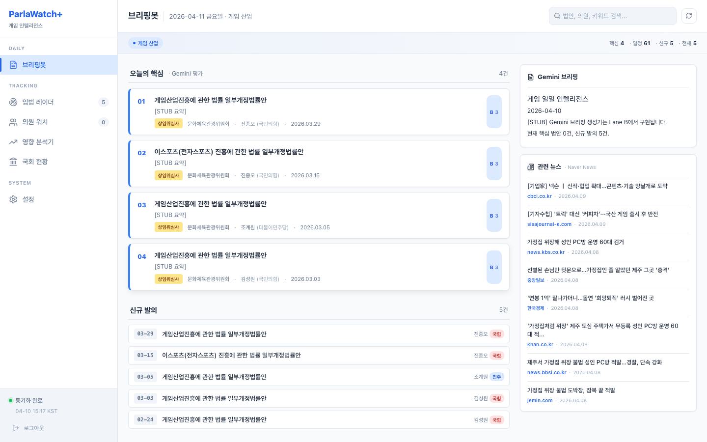
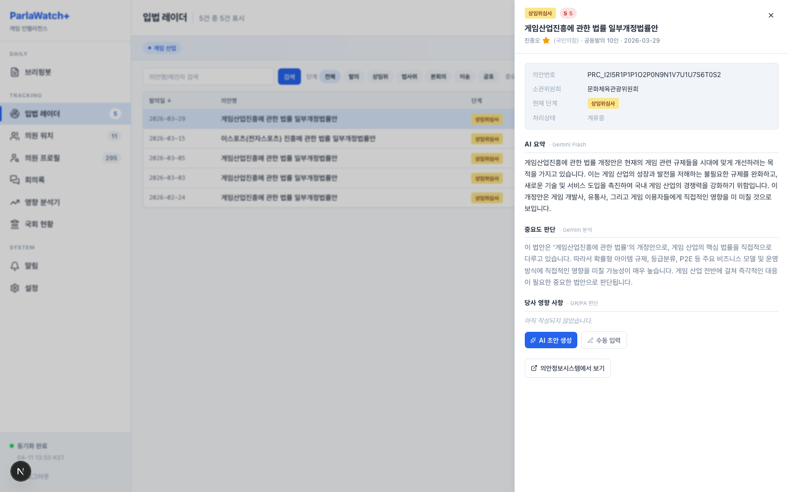
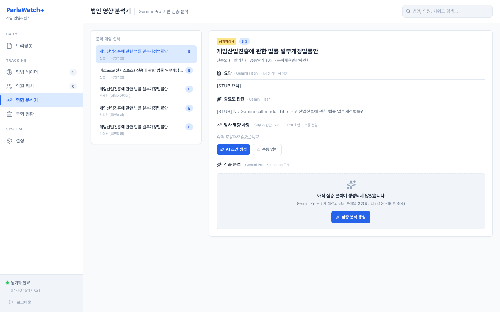
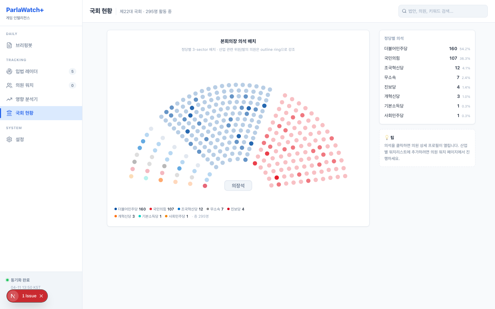
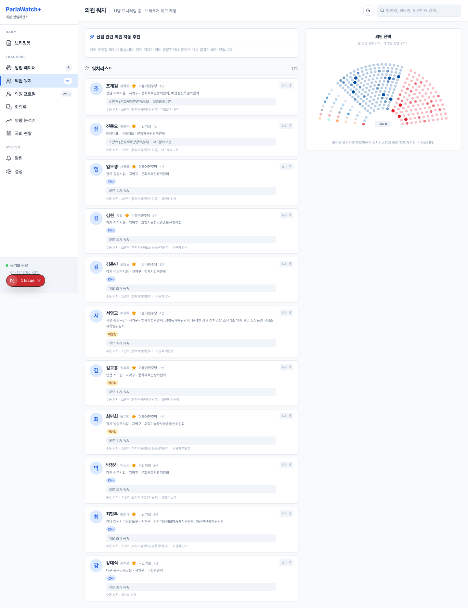
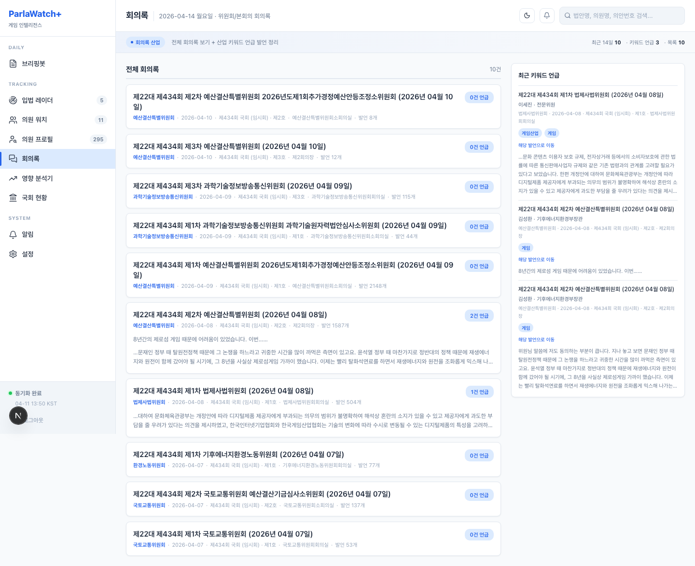
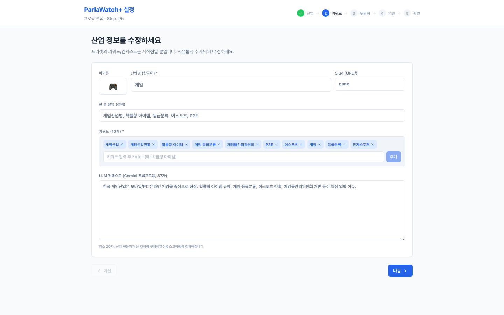

<h1 align="center">ParlaWatch+</h1>

<p align="center">
  <strong>산업별 국회 인텔리전스 대시보드</strong><br/>
  AI 기반 법안 추적, 의원 프로파일링, 매일 아침 GR/PA 브리핑 자동 생성
</p>

> Default documentation and the live app are currently in Korean. For English documentation, see [README.en.md](./README.en.md).<br/>
> 기본 문서와 실제 앱은 현재 한국어 기준입니다. 영어 문서는 [README.en.md](./README.en.md)에서 볼 수 있습니다.

---

> **TL;DR** — Full-stack legislative intelligence dashboard for Korean GR/PA teams. Syncs bills via MCP, scores with Gemini AI, generates daily briefings. 7 industry presets + 8 cross-law mixins (전자상거래법, 정보통신망법, 저작권법 등) for precise watchlists, 295 legislator profiles, auto-sync twice daily. Next.js 15 + Neon Postgres + Gemini. [Non-developer setup guide](./docs/setup-guide.md)

---

## 배경

[ParlaWatch](https://github.com/lowtidebuild/parlawatch)는 국정감사 등 국회 유튜브 방송을 모니터링하는 도구였습니다.
**ParlaWatch+** 는 그 철학을 확장한 **산업별 종합 국회 모니터링 시스템**입니다.

핵심 경험은 단순합니다. 아침에 대시보드를 열면 우리 산업 관련 핵심 법안, 관련 의원, 회의록 키워드 언급, 입법예고, 보도자료까지 한 화면에서 이어서 볼 수 있어야 합니다. 현재 앱은 upstream 최신 `full` 프로필 기준으로 동작하며, `research_data`, `assembly_org(type=lawmaking)`, `get_nabo` 준비 상태도 `/settings`에서 확인할 수 있습니다.

**한 줄 요약**: 매일 아침 출근하면, 우리 산업에 영향 주는 법안이 뭐가 올라왔는지, AI가 정리해서 알려주는 대시보드.

## 스크린샷

### 브리핑봇 — 매일 아침의 출발점



Gemini가 점수 매긴 핵심 법안 카드와 제안자 중요도 별표(S/A/B). 오른쪽은 Gemini Pro가 쓴 일일 브리핑과 Naver News에서 가져온 법안 관련 뉴스.

### 입법 레이더 — 법안 추적 테이블



필터 가능한 법안 테이블 + 슬라이드오버 상세 패널. AI 요약, 중요도 판단, 당사 영향 사항 편집기, 의원 프로필 딥링크가 한 화면에.

### 법안 영향 분석기 — Gemini Pro 심층 분석



법안 선택 시 5개 섹션 구조화 분석: Executive Summary, 핵심 조항, 운영/재무/컴플라이언스 영향, 통과 가능성, 권장 액션.

### 국회 현황 — 22대 295명 의석 배치



실제 본회의장 배치를 반영한 3-sector hemicycle. 산업 중요도에 따라 좌석 밝기가 달라지고, 클릭하면 의원 상세 프로필.

### 의원 워치 — 자동 추천 + 프로필



S/A 등급 의원 자동 추천. 한자명, 선거구, 위원회, 보좌진, 약력, 최근 대표발의 법안까지 의원 상세 페이지에서 확인.

### 회의록 — 전체 원문 + 키워드 발언 추적



상임위/본회의 회의록 전체 원문을 저장하고, 산업 키워드가 언급된 발언만 따로 모아 보여줍니다. 회의명, 회의 일시, 발언자, 원문 위치 딥링크까지 같이 확인할 수 있습니다.

### 설정 위저드 — 5단계 온보딩



산업 프리셋 + 관련 법률 선택 → 키워드 편집 → 위원회 선택 → 의원 선택 → 확인. 게임사가 게임산업법 외에도 전자상거래법·정보통신망법을 동시에 추적하는 식의 교차 법률 조합을 Step 1에서 바로 체크박스로 구성.

---

## 핵심 기능

<table>
<tr>
<td width="50%">

### 자동 동기화
Vercel Cron으로 매일 06:30 / 18:30 KST 자동 실행.
MCP에서 법안 수집 → Gemini Flash 평가 → 브리핑 생성 → 뉴스 수집.

### 산업별 프리셋 7종 + 법률 믹스인 8종
| | 산업 | 키워드 | 위원회 |
|---|---|---|---|
| 🎮 | 게임 | 20개 | 4개 |
| 🛡️ | 정보보안 | 15개 | 3개 |
| 💊 | 바이오 | 15개 | 4개 |
| 💰 | 핀테크 | 15개 | 3개 |
| 💻 | 반도체 | 12개 | 3개 |
| 🛒 | 이커머스 | 15개 | 4개 |
| 🤖 | 인공지능 | 15개 | 4개 |

산업 프리셋 위에 **교차 법률 믹스인** (전자상거래법, 표시·광고법, 정보통신망법, 개인정보보호법, 저작권법, 이스포츠 진흥법, 청소년 보호법, 콘텐츠산업진흥법)을 체크박스로 조합. 게임사가 "게임 + 전자상거래법 + 정보통신망법"을 한 프로필로 모니터링. 직접 입력도 가능, 모든 필드 편집 가능.

</td>
<td width="50%">

### 의원 중요도 S/A/B
소관위 소속 + 최근 180일 대표발의 + 위원장/간사 여부 + 수동 워치를 조합해 자동 계산. 5개 페이지에서 동일 기준으로 표시.

### Gemini AI 분석
- **Flash**: 법안 점수(1-5) + 2-3문장 요약 (동기화 시)
- **Pro**: 일일 브리핑 HTML + 당사 영향 AI 초안 + 5-section 심층 분석 (on-demand)

### 의원 프로필
295명 전체 22대 국회의원. MONA_CD 기반 안정적 추적. 한자명, 영문이름, 이메일, 사무실, 보좌진, 약력, 관련 법안까지.

</td>
</tr>
</table>

---

## 기술 스택

| 영역 | 기술 |
|---|---|
| **Frontend** | Next.js 15 App Router, React 19, Tailwind CSS v4, TypeScript 5 |
| **Database** | PostgreSQL (Neon, HTTP driver), Drizzle ORM |
| **AI** | Gemini 2.5 Flash (scoring), Gemini 3.1 Pro (briefing, 심층 분석) |
| **Data Source** | [assembly-api-mcp](https://github.com/hollobit/assembly-api-mcp) (MCP Streamable HTTP, `full` profile configurable) |
| **News** | Naver News Search API |
| **Hosting** | Vercel (App + Cron), Neon (DB) |
| **Auth** | HMAC-signed cookie (Edge middleware, 7일 세션) |

---

## 빠른 시작

> 비개발자용 상세 가이드: [docs/setup-guide.md](./docs/setup-guide.md)

### 1. 환경 변수

`.env.local` 파일을 만들고 다음 키를 채우세요:

```bash
DATABASE_URL=postgresql://...          # Neon (pooled)
DATABASE_URL_UNPOOLED=postgresql://...  # Neon (direct)
ASSEMBLY_API_MCP_KEY=...               # assembly-api-mcp API key
ASSEMBLY_API_MCP_BASE_URL=...          # optional, self-hosted MCP URL
MCP_PROFILE=full                       # optional, full recommended
GEMINI_API_KEY=...                     # Google AI Studio
NAVER_CLIENT_ID=...                    # Naver Developers
NAVER_CLIENT_SECRET=...                # Naver Developers
APP_PASSWORD=...                       # 로그인 비밀번호 (아무 문자열)
```

`ASSEMBLY_API_MCP_KEY`는 `/setup`, 수동/자동 sync, MCP capability probe 같은
**실시간 MCP 호출 기능**에 필요합니다. 이미 채워진 DB를 조회하는 제한적 로컬 확인은
일부 페이지가 키 없이 열릴 수 있지만, 운영 환경에서는 설정해 두는 것을 권장합니다.

`ASSEMBLY_API_MCP_BASE_URL`를 비우면 공개 upstream (`assembly-api-mcp.fly.dev`)를 사용합니다. `lawmaking` / `NABO` 같은 optional 소스는 **앱 env가 아니라 대상 MCP 서버 쪽 설정**(`LAWMKING_OC`, `NABO_API_KEY`)이 준비되어 있어야 활성화됩니다.

### 운영 점검 명령

```bash
pnpm ci:check          # typecheck + lint + test + build
pnpm preflight:schema  # 최신 필수 컬럼 존재 여부 확인
pnpm smoke:postdeploy  # 운영 배포 후 핵심 경로 스모크 체크
```

### 2. 설치 + DB 마이그레이션

```bash
pnpm install
pnpm db:migrate   # 로컬 개발 DB에만 적용
```

프로덕션 배포는 수동 `pnpm db:migrate` 대상이 아닙니다. `git push origin main`
후 Vercel 빌드가 `pnpm deploy:migrate` → `pnpm build` 순서로 자동 실행합니다.
Preview 배포(`VERCEL_ENV=preview`)는 migration을 건너뜁니다.

### 3. 서버 실행

```bash
pnpm dev    # http://localhost:3000
```

### 4. 산업 프로필 설정

`/setup`에서 산업 프리셋 선택 → 관련 법률 믹스인 체크 (선택) → 키워드/위원회 편집 → 저장.
또는 CLI: `pnpm tsx scripts/seed-test-profile.ts game`

### 5. 첫 동기화

```bash
pnpm tsx scripts/dry-run-morning-sync.ts   # ~45초, 실제 Gemini 호출
```

`/briefing`으로 돌아가면 실제 데이터가 보입니다.

---

## 다른 산업으로 쓰고 싶다면

코드 수정 **0줄**. 런타임 프로필이 모든 Gemini 프롬프트에 주입됩니다.

1. `/setup`에서 원하는 프리셋 선택 (또는 직접 입력)
2. 관련 법률 믹스인 체크 (선택) — 산업을 가로지르는 법률 키워드를 재사용
3. 키워드, 위원회, LLM 컨텍스트 편집
4. 저장 → 다음 동기화부터 해당 산업 법안이 수집됩니다

현재 프리셋: [`src/lib/industry-presets.ts`](./src/lib/industry-presets.ts)
법률 믹스인: [`src/lib/law-mixins.ts`](./src/lib/law-mixins.ts) · 공유 키워드 블록: [`src/lib/law-keyword-blocks.ts`](./src/lib/law-keyword-blocks.ts)

---

## 프로젝트 구조

```
src/
├── app/
│   ├── (dashboard)/          # 6개 대시보드 페이지
│   │   ├── briefing/         # 브리핑봇
│   │   ├── radar/            # 입법 레이더
│   │   ├── impact/           # 영향 분석기
│   │   ├── watch/            # 의원 워치
│   │   ├── assembly/         # 국회 현황
│   │   └── settings/         # 설정
│   ├── setup/                # 5단계 설정 위저드
│   └── api/                  # cron, bills, auth, setup
├── components/               # hemicycle, slide-overs, wizard 등
├── services/                 # sync 오케스트레이터, 뉴스 수집
├── lib/                      # MCP client, Gemini, presets, auth
└── db/                       # Drizzle schema (12 tables)
```

---

## 운영 비용

| 서비스 | 비용 | 비고 |
|---|---|---|
| Neon Postgres | **무료** | Free tier, scale-to-zero |
| Vercel | **무료** | Hobby plan, cron 2회/일 |
| Gemini AI | **~$2-3/월** | Flash scoring + Pro briefing |
| Naver News | **무료** | 25,000 calls/day (현재 ~20/day 사용) |
| assembly-api-mcp | **무료** | 커뮤니티 MCP 서버 |

**실질 비용: 월 $2-3 (Gemini만)**

---

## 알려진 제약

- **MCP cold start**: assembly-api-mcp 서버 cold start 60-90초. Vercel cron이 정기적으로 warm 유지.
- **법안 본문 미노출**: MCP가 제안이유/주요내용을 제공하지 않음. 의안명 + 소관위 + 제안자로만 평가.
- **Optional source readiness varies by MCP server**: 공개 upstream 서버는 `full` 프로필 도구 목록은 제공하지만, `lawmaking` / `NABO`는 대상 MCP 서버에 별도 자격증명이 없는 경우 비활성화될 수 있습니다. 앱은 이를 `/settings`와 `/api/mcp/capabilities`에서 그대로 보여줍니다.

---

## 라이선스

Apache License 2.0 — [LICENSE](./LICENSE)

---

## 크레딧

이 프로젝트는 다음 오픈소스와 서비스 위에 만들어졌습니다:

| | |
|---|---|
| **MCP 데이터** | [@hollobit](https://www.threads.com/@hollobit) / [assembly-api-mcp](https://github.com/hollobit/assembly-api-mcp) |
| **디자인 영감** | [ParlaWatch](https://github.com/lowtidebuild/parlawatch) |
| **AI 엔진** | Google Gemini 2.5 Flash / 3.1 Pro |
| **뉴스 소스** | Naver News Search API |
| **개발 도구** | [Claude Code](https://claude.ai/code) + [OpenAI Codex](https://openai.com/codex) |

---

<p align="center">
  <sub>매일 아침 출근하면, 우리 산업에 영향 주는 법안을 AI가 정리해서 알려줍니다.</sub>
</p>
